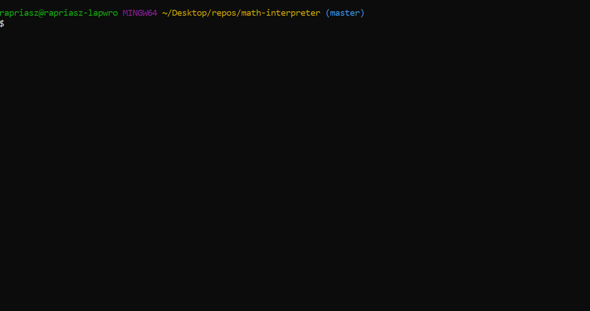

# math-interpreter

Prototype of a math interpreter. Because this project was created only for the learning purpose so there are some limitations sorry :trollface: :

1. supports five binary operators: `+`, `-`, `*`, `/`, `^`
2. supports two unary operators: `+`, `-`
3. supports only integers `i32`

## Demo



## Build & Run :construction_worker:

1. Unoptimized debug build: `cargo build`
2. Optimized production build: `cargo build --release`
3. Run app from debug build: `cargo run`
4. Run app from release build: `cargo run --release`
5. Run all tests: `cargo test`

## Flow

Input string is being converted by the **lexer** (**lexical analyzer**, **scanner** or **tokenizer**) into stream of **tokens**.This process is being called __lexical analysis__.  Then these **tokens** is being passed to the **parser** (**semantic analyzer**).**Parser** converts them into **AST**. This process is being called __syntax analysis__ or __parsing__. Finally **interpreter** runs a visitor mechanism (tree walker) on the **AST** using **postorder traversal** algorithm and finally evaluate a result.

## Grammar

Typical algebraic expression (might) consists of **Terms**, **Factors**, **Powers**, **Coefficients** and **Constants**.In this case I've made little simplification. It's easily visible in the grammar (for the pragmatic reason I'm using EBNF notation):

```
expr   = power ((PLUS | MINUS) power)*
power  = term (POW term)*
term   = factor ((MUL | DIV) power)*
factor = (PLUS | MINUS) factor | INTEGER | LPAREN expr RPAREN
```

## References:

1. https://ruslanspivak.com/
2. https://en.wikipedia.org/wiki/Extended_Backus%E2%80%93Naur_form
3. https://en.wikipedia.org/wiki/Exponentiation_by_squaring
